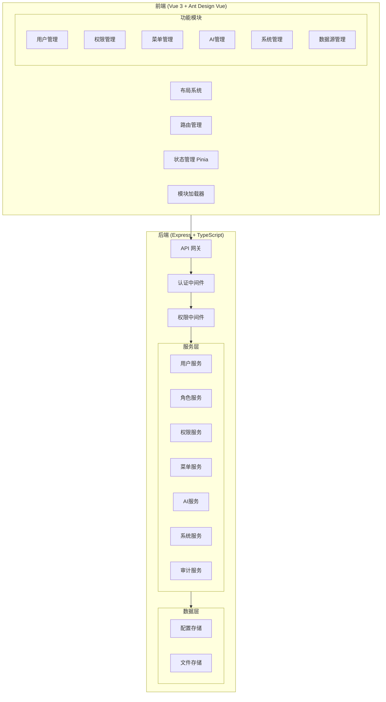
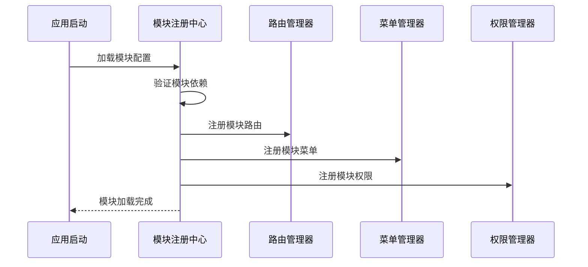

# Design Document: 模块化后台管理框架

## Overview

本设计文档描述一个基于阿里云风格的可扩展后台管理框架。该框架采用前后端分离架构，后端基于现有的 Express + TypeScript 技术栈，前端采用 Vue 3 + TypeScript + Ant Design Vue 实现阿里云风格界面。

核心设计理念：
- **模块化**: 所有功能以模块形式组织，支持动态注册和卸载
- **可扩展**: 提供标准化的模块接口，新功能可即插即用
- **权限驱动**: 基于 RBAC 的细粒度权限控制贯穿整个系统
- **阿里云风格**: 遵循阿里云控制台的 UI/UX 设计规范

## Architecture

### 整体架构图



### 模块注册机制



## Components and Interfaces

### 1. 模块定义接口

```typescript
// 模块元数据接口
interface ModuleMetadata {
  name: string;           // 模块唯一标识
  displayName: string;    // 显示名称
  version: string;        // 版本号
  description: string;    // 模块描述
  icon: string;          // 模块图标
  order: number;         // 排序权重
  dependencies?: string[]; // 依赖的其他模块
}

// 模块路由配置
interface ModuleRoute {
  path: string;
  name: string;
  component: () => Promise<any>;  // 懒加载组件
  meta: {
    title: string;
    icon?: string;
    permission?: string;
    hidden?: boolean;
  };
  children?: ModuleRoute[];
}

// 模块菜单配置
interface ModuleMenu {
  key: string;
  title: string;
  icon?: string;
  path?: string;
  permission?: string;
  order: number;
  children?: ModuleMenu[];
  external?: boolean;     // 是否外部链接
  target?: '_blank' | '_self';
}

// 模块权限配置
interface ModulePermission {
  code: string;           // 权限编码
  name: string;           // 权限名称
  description: string;    // 权限描述
  type: 'menu' | 'button' | 'api';  // 权限类型
}

// 完整模块定义
interface ModuleDefinition {
  metadata: ModuleMetadata;
  routes: ModuleRoute[];
  menus: ModuleMenu[];
  permissions: ModulePermission[];
  install?: (app: App) => void;    // 可选的安装钩子
  uninstall?: () => void;          // 可选的卸载钩子
}
```

### 2. 模块注册中心

```typescript
// 模块注册中心接口
interface ModuleRegistry {
  // 注册模块
  register(module: ModuleDefinition): Promise<void>;
  
  // 卸载模块
  unregister(moduleName: string): Promise<void>;
  
  // 获取已注册模块
  getModule(name: string): ModuleDefinition | undefined;
  
  // 获取所有模块
  getAllModules(): ModuleDefinition[];
  
  // 检查模块依赖
  checkDependencies(module: ModuleDefinition): { valid: boolean; missing: string[] };
  
  // 获取模块加载状态
  getLoadStatus(): Map<string, 'loading' | 'loaded' | 'error'>;
}
```

### 3. 权限系统接口

```typescript
// 角色定义
interface Role {
  id: string;
  name: string;
  code: string;
  description: string;
  permissions: string[];  // 权限编码列表
  parentId?: string;      // 父角色ID（用于继承）
  status: 'active' | 'inactive';
  createdAt: number;
  updatedAt: number;
}

// 权限检查服务
interface PermissionService {
  // 检查用户是否有指定权限
  hasPermission(userId: string, permissionCode: string): Promise<boolean>;
  
  // 检查用户是否有任一权限
  hasAnyPermission(userId: string, permissionCodes: string[]): Promise<boolean>;
  
  // 检查用户是否有所有权限
  hasAllPermissions(userId: string, permissionCodes: string[]): Promise<boolean>;
  
  // 获取用户所有权限
  getUserPermissions(userId: string): Promise<string[]>;
  
  // 获取用户角色
  getUserRoles(userId: string): Promise<Role[]>;
}

// 权限中间件配置
interface PermissionMiddlewareConfig {
  permissionCode: string;
  onDenied?: (req: Request, res: Response) => void;
}
```

### 4. 菜单管理接口

```typescript
// 菜单项
interface MenuItem {
  id: string;
  parentId?: string;
  title: string;
  icon?: string;
  path?: string;
  permission?: string;
  order: number;
  visible: boolean;
  external: boolean;
  target: '_blank' | '_self';
  moduleSource?: string;  // 来源模块
  createdAt: number;
  updatedAt: number;
}

// 菜单服务
interface MenuService {
  // 获取用户可见菜单树
  getUserMenuTree(userId: string): Promise<MenuItem[]>;
  
  // 获取完整菜单树（管理用）
  getFullMenuTree(): Promise<MenuItem[]>;
  
  // 创建菜单项
  createMenuItem(item: Omit<MenuItem, 'id' | 'createdAt' | 'updatedAt'>): Promise<MenuItem>;
  
  // 更新菜单项
  updateMenuItem(id: string, updates: Partial<MenuItem>): Promise<MenuItem>;
  
  // 删除菜单项
  deleteMenuItem(id: string): Promise<void>;
  
  // 批量更新排序
  updateMenuOrder(items: { id: string; order: number; parentId?: string }[]): Promise<void>;
}
```

### 5. 用户管理接口

```typescript
// 扩展用户信息
interface UserDetail extends User {
  avatar?: string;
  phone?: string;
  department?: string;
  lastLoginAt?: number;
  lastLoginIp?: string;
  roles: Role[];
}

// 用户查询参数
interface UserQueryParams {
  keyword?: string;       // 搜索关键词
  status?: UserStatus;
  role?: string;
  department?: string;
  page: number;
  pageSize: number;
  sortBy?: string;
  sortOrder?: 'asc' | 'desc';
}

// 用户服务
interface UserService {
  // 分页查询用户
  queryUsers(params: UserQueryParams): Promise<{ list: UserDetail[]; total: number }>;
  
  // 获取用户详情
  getUserById(id: string): Promise<UserDetail | null>;
  
  // 创建用户
  createUser(data: CreateUserRequest): Promise<UserDetail>;
  
  // 更新用户
  updateUser(id: string, data: UpdateUserRequest): Promise<UserDetail>;
  
  // 删除用户
  deleteUser(id: string): Promise<void>;
  
  // 批量更新状态
  batchUpdateStatus(ids: string[], status: UserStatus): Promise<void>;
  
  // 重置密码
  resetPassword(id: string): Promise<string>;  // 返回新密码
  
  // 分配角色
  assignRoles(userId: string, roleIds: string[]): Promise<void>;
}
```

### 6. AI管理接口

```typescript
// AI提供商配置
interface AIProviderConfig {
  id: string;
  name: string;
  provider: 'openai' | 'qwen' | 'azure' | 'custom';
  apiKey: string;
  apiEndpoint?: string;
  model: string;
  maxTokens: number;
  temperature: number;
  isDefault: boolean;
  status: 'active' | 'inactive';
  createdAt: number;
  updatedAt: number;
}

// AI使用统计
interface AIUsageStats {
  totalRequests: number;
  totalTokens: number;
  estimatedCost: number;
  requestsByDay: { date: string; count: number }[];
  tokensByDay: { date: string; tokens: number }[];
  topUsers: { userId: string; username: string; requests: number }[];
}

// 对话历史
interface ConversationHistory {
  id: string;
  userId: string;
  datasourceId: string;
  question: string;
  answer: string;
  sql?: string;
  tokensUsed: number;
  responseTime: number;
  createdAt: number;
}

// AI管理服务
interface AIManagerService {
  // 获取所有AI配置
  getProviderConfigs(): Promise<AIProviderConfig[]>;
  
  // 创建AI配置
  createProviderConfig(config: Omit<AIProviderConfig, 'id' | 'createdAt' | 'updatedAt'>): Promise<AIProviderConfig>;
  
  // 更新AI配置
  updateProviderConfig(id: string, updates: Partial<AIProviderConfig>): Promise<AIProviderConfig>;
  
  // 验证API Key
  validateApiKey(provider: string, apiKey: string): Promise<boolean>;
  
  // 获取使用统计
  getUsageStats(startDate: number, endDate: number): Promise<AIUsageStats>;
  
  // 查询对话历史
  queryConversations(params: ConversationQueryParams): Promise<{ list: ConversationHistory[]; total: number }>;
}
```

### 7. 系统管理接口

```typescript
// 系统配置项
interface SystemConfig {
  key: string;
  value: string;
  type: 'string' | 'number' | 'boolean' | 'json';
  description: string;
  group: string;
  editable: boolean;
}

// 系统状态
interface SystemStatus {
  cpu: { usage: number; cores: number };
  memory: { total: number; used: number; free: number };
  disk: { total: number; used: number; free: number };
  uptime: number;
  nodeVersion: string;
  platform: string;
}

// 操作日志
interface OperationLog {
  id: string;
  userId: string;
  username: string;
  action: string;
  module: string;
  target: string;
  targetId?: string;
  detail: string;
  ip: string;
  userAgent: string;
  result: 'success' | 'failure';
  errorMessage?: string;
  createdAt: number;
}

// 系统管理服务
interface SystemService {
  // 获取系统配置
  getConfigs(group?: string): Promise<SystemConfig[]>;
  
  // 更新系统配置
  updateConfig(key: string, value: string): Promise<SystemConfig>;
  
  // 获取系统状态
  getSystemStatus(): Promise<SystemStatus>;
  
  // 查询操作日志
  queryOperationLogs(params: LogQueryParams): Promise<{ list: OperationLog[]; total: number }>;
  
  // 导出操作日志
  exportOperationLogs(params: LogQueryParams, format: 'csv' | 'json'): Promise<string>;
}
```

### 8. 审计日志接口

```typescript
// 审计日志
interface AuditLog {
  id: string;
  userId: string;
  username: string;
  action: AuditAction;
  resourceType: string;
  resourceId: string;
  oldValue?: string;      // JSON字符串
  newValue?: string;      // JSON字符串
  ip: string;
  userAgent: string;
  timestamp: number;
  sessionId: string;
}

type AuditAction = 
  | 'login' | 'logout' 
  | 'create' | 'read' | 'update' | 'delete'
  | 'export' | 'import'
  | 'grant_permission' | 'revoke_permission'
  | 'config_change';

// 审计服务
interface AuditService {
  // 记录审计日志
  log(entry: Omit<AuditLog, 'id' | 'timestamp'>): Promise<void>;
  
  // 查询审计日志
  query(params: AuditQueryParams): Promise<{ list: AuditLog[]; total: number }>;
  
  // 导出审计日志
  export(params: AuditQueryParams, format: 'csv' | 'json'): Promise<string>;
  
  // 获取用户操作轨迹
  getUserTrail(userId: string, startTime: number, endTime: number): Promise<AuditLog[]>;
}
```

## Data Models

### 数据存储结构

由于现有项目使用 JSON 文件存储配置，我们将扩展这种模式：

```
data/
├── users.json           # 用户数据
├── roles.json           # 角色数据
├── permissions.json     # 权限数据
├── menus.json          # 菜单配置
├── ai-configs.json     # AI配置
├── system-configs.json # 系统配置
├── audit-logs/         # 审计日志（按日期分文件）
│   ├── 2026-01-13.json
│   └── ...
└── conversations/      # 对话历史（按用户分文件）
    ├── user-xxx.json
    └── ...
```

### 核心数据模型

```typescript
// 用户数据模型
interface UserData {
  id: string;
  username: string;
  passwordHash: string;
  email?: string;
  fullName?: string;
  avatar?: string;
  phone?: string;
  department?: string;
  role: UserRole;
  status: UserStatus;
  roleIds: string[];      // 关联的角色ID列表
  lastLoginAt?: number;
  lastLoginIp?: string;
  createdAt: number;
  updatedAt: number;
}

// 角色数据模型
interface RoleData {
  id: string;
  name: string;
  code: string;
  description: string;
  permissionCodes: string[];
  parentId?: string;
  status: 'active' | 'inactive';
  isSystem: boolean;      // 是否系统内置角色
  createdAt: number;
  updatedAt: number;
}

// 菜单数据模型
interface MenuData {
  id: string;
  parentId?: string;
  title: string;
  icon?: string;
  path?: string;
  component?: string;     // 组件路径
  permission?: string;
  order: number;
  visible: boolean;
  external: boolean;
  target: '_blank' | '_self';
  moduleSource?: string;
  isSystem: boolean;      // 是否系统内置菜单
  createdAt: number;
  updatedAt: number;
}

// 通知数据模型
interface NotificationData {
  id: string;
  userId: string;
  type: 'system' | 'warning' | 'info' | 'success';
  title: string;
  content: string;
  link?: string;
  read: boolean;
  createdAt: number;
}
```


## Correctness Properties

*A property is a characteristic or behavior that should hold true across all valid executions of a system—essentially, a formal statement about what the system should do. Properties serve as the bridge between human-readable specifications and machine-verifiable correctness guarantees.*

### Property 1: Module Registration Round-Trip

*For any* valid module definition, registering the module and then unregistering it should leave the system in its original state with no residual routes, menus, or permissions.

**Validates: Requirements 1.2, 1.3, 1.4**

### Property 2: Module Dependency Validation

*For any* module with declared dependencies, if any dependency is not registered, the Module_Registry should reject registration and return the list of missing dependencies.

**Validates: Requirements 1.6**

### Property 3: User Query Consistency

*For any* set of users and query parameters (keyword, status, role, pagination), the returned list should contain only users matching all specified criteria, and the total count should reflect the full matching set.

**Validates: Requirements 3.1**

### Property 4: Username Uniqueness Enforcement

*For any* username that already exists in the system, attempting to create a new user with that username should fail with an appropriate error message.

**Validates: Requirements 3.2**

### Property 5: User Status Transition Validity

*For any* user and valid status value, updating the user's status should persist the change and be reflected in subsequent queries.

**Validates: Requirements 3.3**

### Property 6: Batch Operation Atomicity

*For any* batch operation on a set of users, either all users should be updated successfully, or none should be updated (in case of error).

**Validates: Requirements 3.5**

### Property 7: Permission Inheritance Completeness

*For any* role with a parent role, the effective permissions should include all permissions from the parent role plus the role's own permissions.

**Validates: Requirements 4.2**

### Property 8: Permission Verification Correctness

*For any* user attempting to access a protected resource, access should be granted if and only if the user has the required permission (directly or through role inheritance).

**Validates: Requirements 4.3, 4.6**

### Property 9: Menu Hierarchy Depth Limit

*For any* menu structure, no menu item should have a nesting depth greater than 3 levels.

**Validates: Requirements 5.1**

### Property 10: Menu Permission Filtering

*For any* user, the rendered menu tree should contain only items for which the user has the associated permission.

**Validates: Requirements 5.3**

### Property 11: Disabled Menu Preservation

*For any* disabled menu item, it should not appear in user navigation but should remain in the admin menu management view.

**Validates: Requirements 5.6**

### Property 12: AI Usage Statistics Accuracy

*For any* time period, the reported AI usage statistics (request count, token usage) should equal the sum of individual conversation records within that period.

**Validates: Requirements 6.2**

### Property 13: AI Provider Configuration Isolation

*For any* number of AI provider configurations, each should be independently configurable and the default provider should be uniquely designated.

**Validates: Requirements 6.5**

### Property 14: Audit Log Completeness

*For any* user operation (create, update, delete, login, config change), an audit log entry should be created containing user ID, action, timestamp, IP address, and operation result.

**Validates: Requirements 3.4, 7.5, 10.1, 10.2**

### Property 15: Audit Log Search Correctness

*For any* search criteria (time range, user, action type), the returned audit logs should match all specified criteria.

**Validates: Requirements 10.3**

### Property 16: Audit Log Export Format Validity

*For any* export request in CSV or JSON format, the exported file should be parseable and contain all matching audit log entries.

**Validates: Requirements 10.4**

### Property 17: Notification Badge Count Accuracy

*For any* user, the notification badge count should equal the number of unread notifications for that user.

**Validates: Requirements 9.3**

### Property 18: Notification Status Management

*For any* notification, marking it as read should update its status and decrease the unread count by one.

**Validates: Requirements 9.4**

### Property 19: Datasource Connection Test Validity

*For any* datasource configuration, the connection test should return success for valid configurations and detailed error information for invalid ones.

**Validates: Requirements 8.2, 8.4**

### Property 20: System Backup and Restore Round-Trip

*For any* system state, performing a backup and then restoring from that backup should result in an equivalent system state.

**Validates: Requirements 7.6**

## Error Handling

### 错误分类

| 错误类型 | HTTP状态码 | 错误码前缀 | 描述 |
|---------|-----------|-----------|------|
| 认证错误 | 401 | AUTH_ | 未登录或token过期 |
| 授权错误 | 403 | PERM_ | 无权限访问 |
| 验证错误 | 400 | VALID_ | 请求参数验证失败 |
| 资源错误 | 404 | RES_ | 资源不存在 |
| 业务错误 | 422 | BIZ_ | 业务规则冲突 |
| 系统错误 | 500 | SYS_ | 系统内部错误 |

### 错误响应格式

```typescript
interface ErrorResponse {
  success: false;
  error: {
    code: string;        // 错误码，如 AUTH_TOKEN_EXPIRED
    message: string;     // 用户友好的错误信息
    details?: any;       // 详细错误信息（开发环境）
    timestamp: number;
    requestId: string;
  };
}
```

### 关键错误处理场景

1. **模块注册失败**: 依赖缺失时返回 `BIZ_MODULE_DEPENDENCY_MISSING`，包含缺失模块列表
2. **权限验证失败**: 返回 `PERM_ACCESS_DENIED`，不暴露具体缺失的权限
3. **用户名重复**: 返回 `BIZ_USERNAME_EXISTS`
4. **密码强度不足**: 返回 `VALID_PASSWORD_WEAK`，包含密码要求说明
5. **AI API Key无效**: 返回 `BIZ_AI_KEY_INVALID`

## Testing Strategy

### 测试框架选择

- **单元测试**: Vitest（与现有项目兼容）
- **属性测试**: fast-check（TypeScript 原生支持的 PBT 库）
- **E2E测试**: Playwright（可选，用于前端测试）

### 双重测试方法

本项目采用单元测试和属性测试相结合的方式：

1. **单元测试**: 验证具体示例、边界情况和错误条件
2. **属性测试**: 验证跨所有输入的通用属性

### 属性测试配置

```typescript
// 属性测试配置示例
import fc from 'fast-check';

// 每个属性测试至少运行100次迭代
const propertyConfig = {
  numRuns: 100,
  verbose: true
};

// 测试标注格式
// Feature: modular-admin-framework, Property 1: Module Registration Round-Trip
```

### 测试覆盖要求

| 模块 | 单元测试 | 属性测试 |
|------|---------|---------|
| 模块注册中心 | 基本CRUD | Property 1, 2 |
| 用户管理 | 边界情况 | Property 3, 4, 5, 6 |
| 权限系统 | 权限检查 | Property 7, 8 |
| 菜单管理 | 菜单操作 | Property 9, 10, 11 |
| AI管理 | 配置验证 | Property 12, 13 |
| 审计日志 | 日志记录 | Property 14, 15, 16 |
| 通知中心 | 通知操作 | Property 17, 18 |
| 数据源管理 | 连接测试 | Property 19 |
| 系统管理 | 备份恢复 | Property 20 |

### 生成器设计

```typescript
// 用户数据生成器
const userArbitrary = fc.record({
  username: fc.string({ minLength: 3, maxLength: 20 }).filter(s => /^[a-zA-Z0-9_]+$/.test(s)),
  email: fc.emailAddress(),
  fullName: fc.string({ minLength: 1, maxLength: 50 }),
  role: fc.constantFrom('admin', 'user', 'viewer'),
  status: fc.constantFrom('active', 'inactive', 'suspended', 'pending')
});

// 模块定义生成器
const moduleArbitrary = fc.record({
  name: fc.string({ minLength: 1, maxLength: 30 }).filter(s => /^[a-z-]+$/.test(s)),
  displayName: fc.string({ minLength: 1, maxLength: 50 }),
  version: fc.tuple(fc.nat(10), fc.nat(10), fc.nat(10)).map(([a, b, c]) => `${a}.${b}.${c}`),
  routes: fc.array(routeArbitrary, { maxLength: 10 }),
  menus: fc.array(menuArbitrary, { maxLength: 10 }),
  permissions: fc.array(permissionArbitrary, { maxLength: 20 })
});

// 权限生成器
const permissionArbitrary = fc.record({
  code: fc.string({ minLength: 1, maxLength: 50 }).filter(s => /^[a-z:_]+$/.test(s)),
  name: fc.string({ minLength: 1, maxLength: 50 }),
  type: fc.constantFrom('menu', 'button', 'api')
});
```
